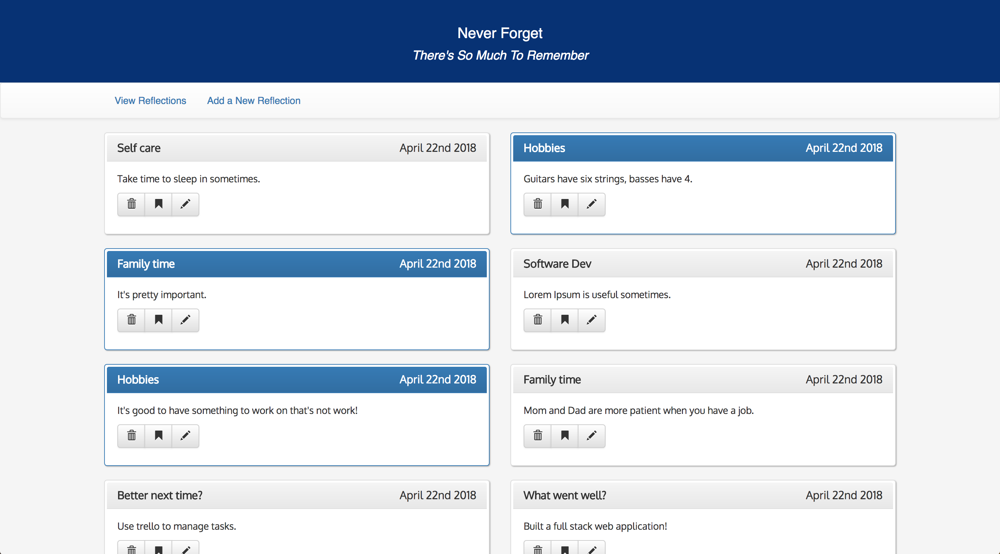

# Reflections App

A modest two-page application that allows the user to create, edit, bookmark and delete lessons learned. My very first app built in React.js! 




## This application is built with: 
- React.js
- Node.js
- React-Bootstrap
- Moment.js
- PostgreSQL
- pg 

## Instalation
In Node.js: 
- npm install
- npm run server
- npm run client

PostgreSQL: 

CREATE DATABASE "reflection_board";

```
CREATE TABLE "reflection" (
  "id" serial primary key,
  "topic" varchar(120),
  "description" varchar(480),
  "bookmarked" boolean default false,
  "date" date not null default CURRENT_DATE
);

-- Sample reflection
INSERT INTO "reflection" ("topic", "description")
VALUES ('What went well?', 'Gave an ice breaker at public speaking practice.'),
('Better next time?', 'Get more sleep.'),
('What went well?', 'Built a full stack web application!'),
('Better next time?', 'Use trello to manage tasks.');
```

### Handcrafted by R. Atticus Pomerantz